  
  <h1>🌟 Bem-vindo ao Lusca's Epic GitHub! 💖</h1>
  
Oi! Eu sou o Lusca, um dev aventureiro como o Kirby, pronto para adquirir novas habilidades e explorar mundos de código! ☁️

---

### 🌸 Sobre Mim!
- **Quem sou eu?** Estudante de Ciência da Computação na Universidade Federal do Maranhão (UFMA), apaixonado por jogos e algoritmos. Como o Kirby, adoro absorver conhecimentos e transformar ideias em projetos fofos! 💕
- **Localização:** Maranhão, Brasil 🇧🇷
- **Interesses:** Jogos, programação criativa e contribuições open-source. 🌟

  
  

---

### 🎀 Meus Poderes – Habilidades!
<h3 align="center">
  
  Como o Kirby copia poderes, aqui vão os meus favoritos:
  
</h3>

  <ul>
    <li><b>Python 🐍</b>: Meu poder principal! Uso para puzzles e ferramentas úteis.</li>
    <li><b>JavaScript/TypeScript 🌐</b>: Para criar jogos web e apps interativos.</li>
    <li><b>Outros</b>: HTML/CSS para fronts, Git para versionamento e algoritmos (buscas, otimização).</li>
    <li><b>Ferramentas</b>: VS Code, GitHub, Pygame e Unity para games.</li>
  </ul>

---

### ☁️ Minhas Aventuras – Projetos Destacados!

  

- **[indexador_de_verbetes](https://github.com/Luscafp/indexador_de_verbetes)** (Python): Indexador inteligente para verbetes – rápido como Kirby voando!
- **[PacMan](https://github.com/Luscafp/PacMan)** (JavaScript): Clone do Pac-Man. Fuja dos fantasmas! 👻 (Demo em breve no GitHub Pages).
- **[quebra_cabeca_dos_8](https://github.com/Luscafp/quebra_cabeca_dos_8)** (Python): Solver para o puzzle dos 8.
- **[teasm-sm](https://github.com/Luscafp/teasm-sm)** (TypeScript): App para auxiliar na indicação de vitaminas para crianças e gestantes.
- **[X-Vektor](https://github.com/Luscafp/X-Vektor)** (Python): Projeto vetorial para manipulação de dados.
- **[awesome-ufma](https://github.com/elheremes/awesome-ufma)** (Fork em Python): Contribuo para uma lista épica de provas da UFMA! 📚

---

### 📊 Minhas Stats – Estrelas no Céu de Dream Land!

  

---

### 💌 Contatos

 

📧 **Email:** [lucasfariaslfp@gmail.com](mailto:lucasfariaslfp@gmail.com) 
💼 **LinkedIn:** [linkedin.com/in/lucas-lfp](https://www.linkedin.com/in/lucas-lfp/) 
💬 **Outros:** Abra uma issue ou PR nos meus repositórios!

 
---

  
<b>Obrigado por visitar meu mundo Kirby! 🌟 </b>

  
  
<b>Dê uma ⭐ no perfil e vamos criar mais aventuras juntos! 💖☁️</b>

  
<i>Made by Luscafp | Inspirado nos jogos Kirby da Nintendo</i>

